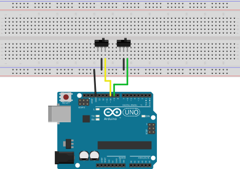

# Poor man's KVM switch
Pass keyboard, mouse and monitors between virtual machines and their host.

## Description

The poor man's KVM switch is a Arduino-based device to pass control of keyboards, mice, other USB devices, but also monitors if they support DDC/CI, to a virtual machine. The VM can access these devices directly, resulting in less latency and no required network traffic, compared to use of software solutions like Synergy. 

# How it works

The micro controllers firmware connects as an USB-HID and sends hot keys to the host OS. Depending on those, scripts are run to either pass through usb devices or switch monitor input sources.

# Setup

## Hardware
Required are:
- An arduino compatible micro controller. I used and recommend the DFRobot Beetle for its small size. Also get a matching USB cable.
- One button or switch per device group (i.e one per monitor and one keyboard and mouse) to pass through. I recommend toggle switches like the MS-500A.
- A case for the micro controller and switches. I used [this one](https://www.reichelt.com/de/en/Plastic-small-Enclosures/RND-455-00055/3/index.html?ACTION=3&GROUPID=7715&ARTICLE=170587)
- Monitors must be connected to both the passed-through and the host's graphics device.

### Example schematic

Wire everything together and flash the provided .ino file. You can test the device by mapping the hot keys (CTRL+META+SHIFT+ one of W, S, R, F, T, G if you didn't change them) to send a notification or start a program.

## Software
This section assumes you are using libvirt to manage your virtual machine. Other VM management software can be used if you adapt the scripts to pass mouse and keyboard to the virtual machine.

### USB devices

First we need the vendor and product id of the USB devices to pass. Run lsusb and copy the bolded entries of the correct device:
<pre>
Bus 003 Device 003: ID <b>046d:c531</b> Logitech, Inc. C-U0007 [Unifying Receiver]
</pre>
If you are not sure which device is your mouse or keyboard (or other device you want to pass), then run lsusb, unplug the device and run it again. For keyboards use your shells sleep command to run lsusb without the keyboard plugged in.

Create one xml file per usb device, fill in the following lines:
~~~:
<hostdev mode='subsystem' type='usb'>   
  <source>                              
    <vendor id='0x046d'/> 
    <product id='0xc531'/>
  </source>                             
</hostdev>
~~~
and replace vendor and product id with those shown by lsusb.

Create one or more shell scripts to attach and detach USB devices, for example:
~~~:
#!/bin/bash
VMNAME="win10"
virsh attach-device $VMNAME mouse.xml &
#use virsh detach-device $VMNAME mouse.xml & to detach
virsh attach-device $VMNAME keyboard.xml &
~~~

Ensure your user has privileges to run virsh: [See here](https://wiki.archlinux.org/index.php/Libvirt#Set_up_authentication)

## Monitors

Monitors don't need to be passed to the virtual machine, instead they need to be instructed to switch to another input source. Use [ddcutil](https://github.com/rockowitz/ddcutil) on the host, for example:
### Host
~~~:
$ sudo ddcutil detect # detect available monitors
Display 1
   [Info about first monitor]

Display 2
   [Info about second monitor]
$ sudo ddcutil capabilities -d 1 # show input sources of monitor 1
[... capabilitites ...]
   Feature: 60 (Input Source)
      Values:
         01: VGA-1
         0f: DisplayPort-1
         11: HDMI-1
[... more capabilities ...]
$ sudo ddcutil setvcp -d 60 0f # switch to display port
~~~
Note: Some monitors support feature 0x60, but don't list it in the capabilities string. If your monitor does not, you can try the last command anyway, but with different values, most are less than 0x0f.

Create one or more shell scripts (one per monitor) to select different input sources:
~~~:
#!/bin/bash
sudo ddcutil setvcp 60 0f -d 1 &
~~~
Also ensure to be able to run ddcutil without password prompt.
### Guest
As the monitors are now connected to the virtual machine, to pass them back to the host you need to send hot keys from the microcontroller to the guest, which is done as described here:

Create a script like the following and register a hot key on the host.
~~~:
#!/bin/bash
virsh send-key win10 --codeset win32 VK_CONTROL VK_LSHIFT VK_MENU 0x53 &
~~~
Windows key codes are listed [here](https://docs.microsoft.com/en-us/windows/desktop/inputdev/virtual-key-codes).

On the VM side of things you can also use ddcutil, or if you are virtualizing Windows, use my work-in-progress port found [here](https://github.com/rtrbt/winddcutil). Write equivalent scripts for the guest, and register hot keys for them.
